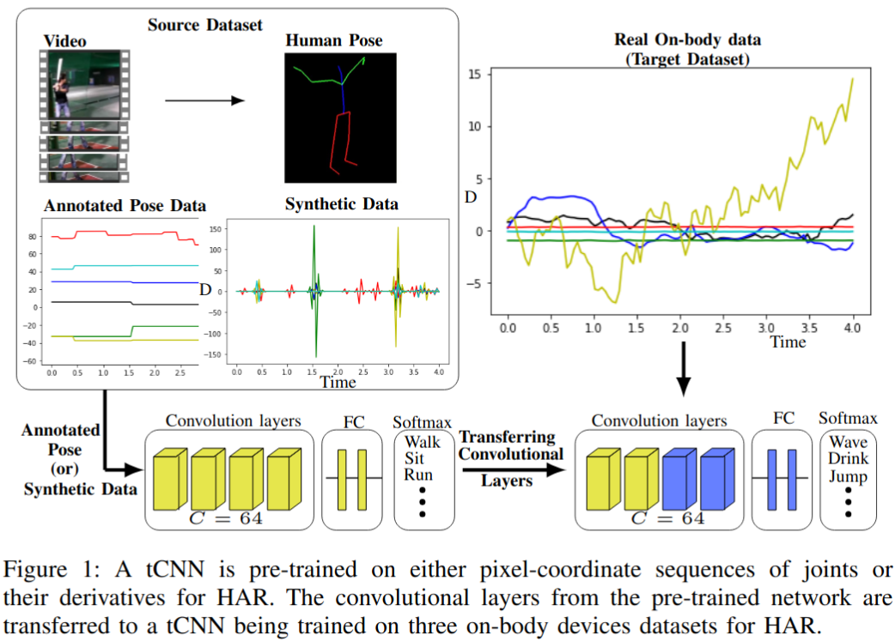

# Video-based Pose-Estimation Data as Source for Transfer Learning in Human Activity Recognition [[ICPR 2022](https://ieeexplore.ieee.org/stamp/stamp.jsp?tp=&arnumber=9956405)]

Human Activity Recognition (HAR) using on-body
devices identifies specific human actions in unconstrained envi-
ronments. HAR is challenging due to the inter and intra-variance
of human movements; moreover, annotated datasets from on-
body devices are scarce. This problem is mainly due to the
difficulty of data creation, i.e., recording, expensive annotation,
and lack of standard definitions of human activities. Previous
works demonstrated that transfer learning is a good strategy for
addressing scenarios with scarce data. However, the scarcity of
annotated on-body device datasets remains. This paper proposes
using datasets intended for human-pose estimation as a source for
transfer learning; specifically, it deploys sequences of annotated
pixel coordinates of human joints from video datasets for HAR
and human pose estimation. We pre-train a deep architecture
on four benchmark video-based source datasets. Finally, an
evaluation is carried out on three on-body device datasets
improving HAR performance.

  
 
  

# Method
We used JHMDB, CAD 60, Penn Action, PAMAP2, NTU RGB-D, Opportunity and LARA datasets. These datasets contain annotated recordings of human poses from different scenarios with a broad range of human activities in
the wild. These humanpose annotations from videos are considered multi-channel time-series of human movements.
<ul>
  <li>  We use the second derivative of a smooth piecewise spline interpolation of degree five on a
small-time interval from sequences of human joint-poses for simulating on-body devices attached to the poses, a sort of
synthetic data</li>
  <li>The processed data is then fed into a temporal convolutional neural network (tCNN) which is used as a feature extractor and classifier. /li>
  <li>The network is first trained on a source dataset (JHMDB, CAD 60, Penn Action, NTU RGB-D). Subsequently the trained network is fine tuned on a portion on target dataset (PAMAP2, , Opportunity and LARA datasets=.</li>
</ul>

Create synthetic IMU data from videos

Goal - Use a source dataset with poses, transform them to acceleration (synthetic IMU data). Then test it on target dataset.
